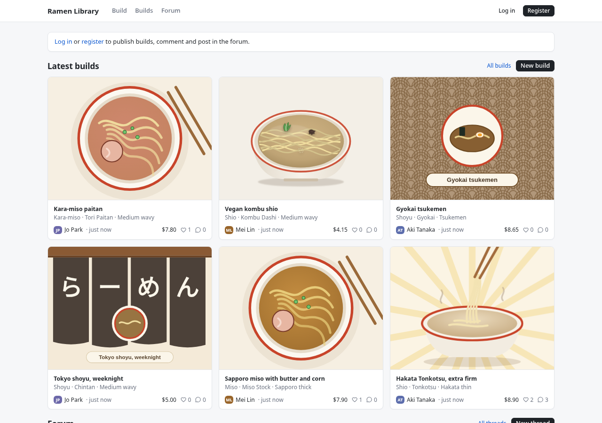
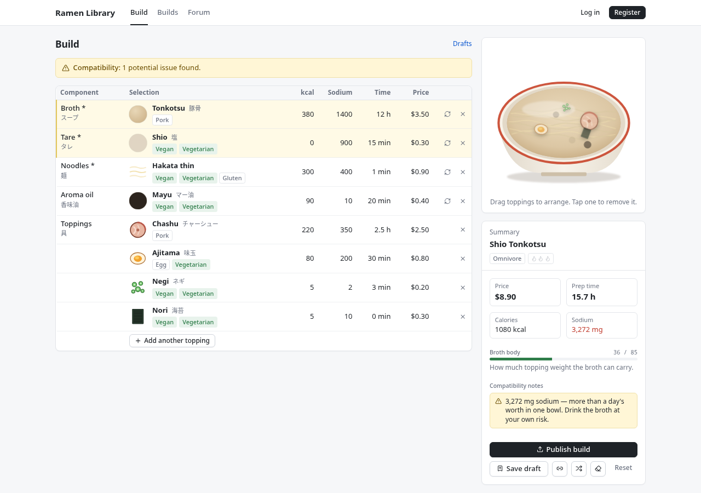
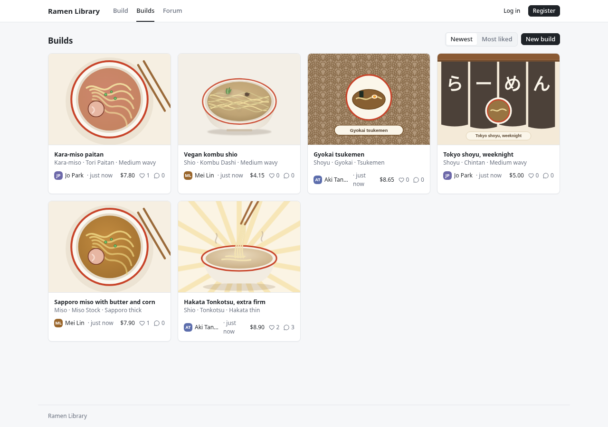
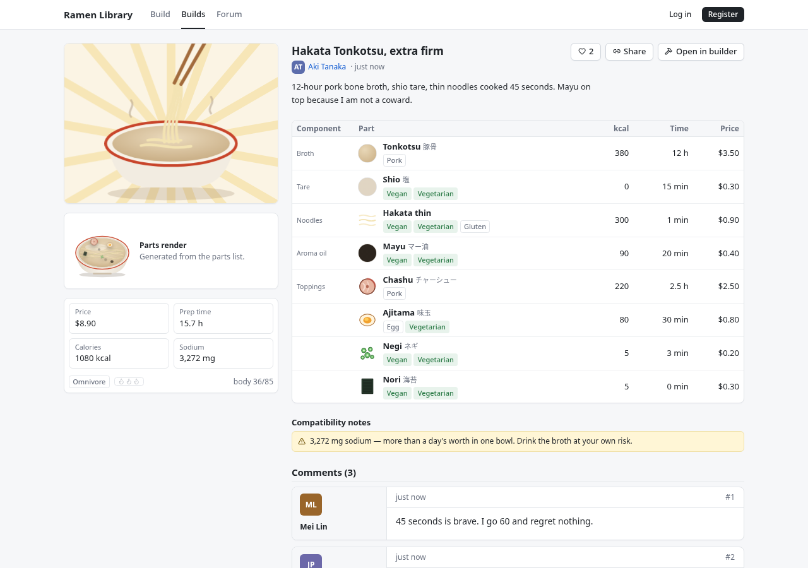
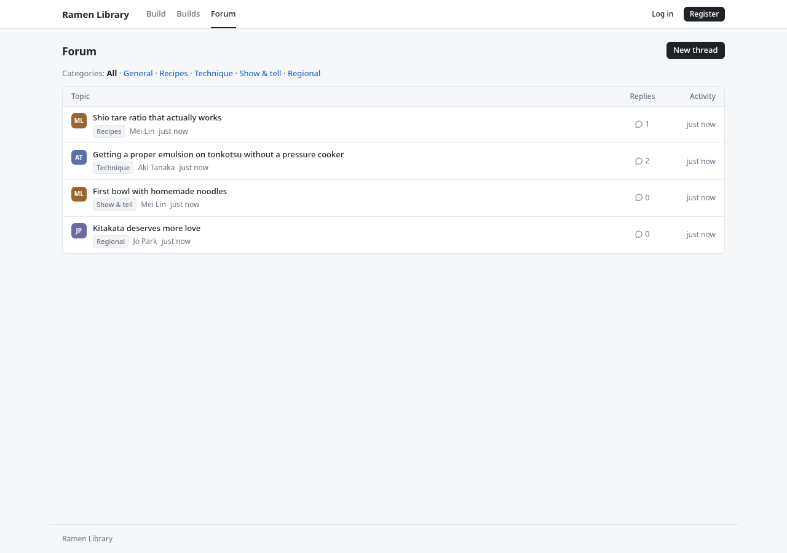
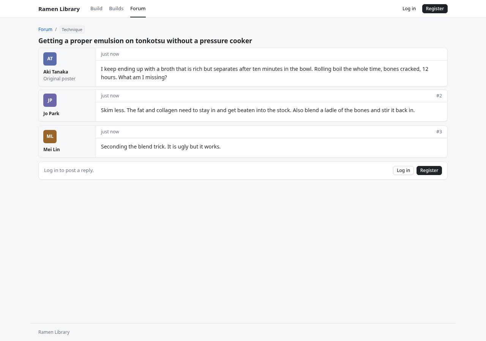

# Ramen Library 🍜

**PCPartPicker, but for ramen.**

Pick a broth, a tare, noodles, an aroma oil and toppings from a parts catalogue with real specs (price, prep time, calories, sodium, diet tags). A compatibility checker flags builds that don't work — thin noodles under miso, butter on a clear broth, more toppings than the broth can carry. Totals update live and the bowl renders as you go.

Then publish it. Accounts, a community gallery with likes and comments, a forum, user profiles — the whole site, backed by a small API and a libSQL database, all self-hosted.

Every published build gets a cover: a photo you upload (resized and re-encoded to WebP on the server), or one of five illustrated templates that tint themselves to your broth for people who haven't shot the bowl yet.

## Screenshots

| Home | Builder |
| --- | --- |
|  |  |

| Builds gallery | Build detail |
| --- | --- |
|  |  |

| Forum | Thread |
| --- | --- |
|  |  |

## Design

"Warm paper." Cream ground, white rounded cards, chili red as the one loud colour, yolk and scallion as friendly secondaries. Nunito for text, Fraunces for headlines. Categories are colour-coded so the forum scans at a glance. Tokens live in `src/index.css`; a dark palette is kept under `.dark` for a future toggle.

## How it maps

| PCPartPicker | Ramen Library |
| --- | --- |
| Component slots (CPU, GPU, …) | Broth, tare, noodles, aroma oil, toppings (multiple) |
| Parts list with specs & prices | `src/data/ingredients.ts` — price, minutes, kcal, sodium, tags |
| Compatibility checker | `src/lib/compat.ts` — errors, warnings, notes per slot |
| Wattage vs. PSU | Topping "body" vs. broth richness |
| Price total | Price, prep time, calories, sodium totals |
| Saved builds | Drafts (localStorage) and published builds (database) |
| Completed builds gallery | `/builds` with likes and comments |
| Forums | `/forum` with categories, threads and replies |
| User profiles | `/u/:id` — builds, threads, bio |
| Permalink | `/builds/:id`, plus `#b=…` hash links for unpublished drafts |

## Run it

Needs [Bun](https://bun.sh) 1.4+.

```bash
bun install
bun run dev         # web on http://localhost:5173, API on :3000 (proxied under /api)
bun run build       # typecheck (tsc -b) + production build into dist/
bun run start       # production: API + static site on :3000
bun test            # server test suite
bun run lint        # oxlint
bun run db:migrate  # apply migrations by hand (optional — the server does this at boot too)
```

The libSQL database (a local file in dev, `sqld` in production) is created and migrated automatically at boot. No manual setup.

**Upgrading from the Drizzle version:** the current migration creates all tables unconditionally and Better Auth's tables now use camelCase columns, so an existing pre-migration `data/ramen.db` will fail at boot with an error like `table user already exists`. Delete or move that file (it's only test data) — `rm data/ramen.db` — or, if you need to keep real data, follow the data-migration section of the self-hosted stack plan instead of deleting it.

Environment (all optional in dev — copy [`.env.example`](.env.example) to `.env` to override):

| Var | Dev default | Purpose |
| --- | --- | --- |
| `DATABASE_URL` | `file:data/ramen.db` | libSQL connection: a local file in dev, `http://sqld:8080` in production |
| `DATABASE_AUTH_TOKEN` | empty | Only needed if `sqld` is started with auth enabled |
| `S3_ENDPOINT` | empty | Object storage endpoint. Empty falls back to local disk (`UPLOAD_DIR`, served at `/uploads/*`); in production, Garage's S3 API (`http://garage:3900`) |
| `S3_REGION` | `garage` | S3 region (Garage accepts any value; conventionally `garage`) |
| `S3_BUCKET` | `ramen-uploads` | Bucket name, ignored when `S3_ENDPOINT` is empty |
| `S3_ACCESS_KEY_ID` / `S3_SECRET_ACCESS_KEY` | empty | From `garage key create`, ignored when `S3_ENDPOINT` is empty |
| `S3_PUBLIC_URL` | empty | Public base URL images are served from (Caddy → Garage's web endpoint) |
| `UPLOAD_DIR` | `data/uploads` | Local-disk upload directory, used only when `S3_ENDPOINT` is empty |
| `BETTER_AUTH_SECRET` | dev placeholder | **Set this in production.** Signs sessions |
| `BETTER_AUTH_URL` | `http://localhost:5173` | Public origin of the site |
| `TRUSTED_ORIGINS` | empty | Extra comma-separated origins Better Auth should trust, beyond `BETTER_AUTH_URL`'s origin and the Vite dev defaults |
| `PORT` / `HOST` | `3000` / `127.0.0.1` | API bind |
| `EMAIL_PROVIDER_KEY` | empty | Resend API key for verification email. Empty just logs the link and leaves verification unenforced |

## Stack

| Layer | Choice | Why |
| --- | --- | --- |
| Build | Vite 8 + React 19 + TypeScript | Instant HMR, no framework tax for a client-only app |
| Styling | Tailwind CSS v4 | CSS-first config, `@theme` tokens, tiny output |
| Primitives | Base UI (`@base-ui-components/react`) | The primitive layer shadcn/ui now defaults to; accessible, headless |
| Components | shadcn/ui-style, hand-written in `src/components/ui` | Owned code, not a dependency |
| Motion | Motion (`motion/react`) | Springs, layout animation, drag — the toppings physics |
| State | Zustand + `persist` | Current build + drafts, saved to `localStorage` |
| Routing | React Router (data router) | Loaders per page, `useRevalidator` after mutations |
| Icons | Lucide | The shadcn default |
| Runtime | Bun | One binary, fast installs and TS execution, no separate build step in dev |
| API | Elysia | Tiny, typed, Web-standard; `/api/*` |
| API client | Eden (`@elysiajs/eden`) | Typed client, types inferred from the server — no hand-written fetch wrapper |
| Auth | Better Auth | Email + password, cookie sessions, Kysely adapter |
| Database | Kysely + libSQL (`@libsql/client`) | Local file in dev, `sqld` container in production |
| Query cache | TanStack Query | Mutations (like button) layered on top of the router loaders |
| Image storage | Garage (S3-compatible) in production, local disk in dev | Chosen via `server/storage.ts` based on `S3_ENDPOINT` |
| Validation | Zod, shared between client and server | `shared/validation.ts`, passed to Elysia routes via Standard Schema |

See [`docs/UI_LIBRARY_RESEARCH.md`](docs/UI_LIBRARY_RESEARCH.md) for what was considered and why.

## Layout

```
shared/         ingredients.ts (parts catalogue), bowl.ts (types), validation.ts (zod) — used by both sides
server/
  index.ts      Runs migrations, then starts `app` listening
  app.ts        Elysia app: error handling, session, auth handler, API, static serving (exported without .listen for tests)
  routes.ts     /api — builds, likes, comments, forum, users, home
  session.ts    Elysia plugin: attaches the Better Auth session as `user` on every request
  auth.ts       Better Auth config (Kysely adapter)
  email.ts      Verification email send hook (Resend, no-ops without EMAIL_PROVIDER_KEY)
  errors.ts     ApiError
  storage.ts    Storage abstraction: Garage (S3) in production, local disk in dev
  uploads.ts    Upload validation + sharp pipeline (resize, WebP, thumbnail), calls storage.ts
  db/           client.ts (Kysely + libSQL), types.ts (DB interface), migrate.ts, migrations/
src/
  pages/        Home, Builder, Drafts, Builds, Build, Forum/NewThread/Thread, Profile/Settings, Login/Signup
  components/
    ui/         button, card, badge, input, textarea, avatar, tabs, dialog, slider, tooltip
    build/      BuildTable, PartPickerDialog, BuildSummary + CompatBar, CoverArt (templates), CoverPicker (upload)
    bowl/       BowlCanvas (SVG preview + draggable toppings), ToppingGlyph
    social/     BuildCard, Discussion (comments and forum replies)
    site/       Layout (header/nav/footer), PageBits
    library/    LibraryGrid (drafts)
  store/        bowl.ts — zustand store (current build + drafts)
  lib/          api.ts, auth-client.ts, compat.ts, totals.ts, share.ts, naming.ts
```

## API

All under `/api`. Writes need a session cookie (401 otherwise).

| Method | Path | What |
| --- | --- | --- |
| GET | `/home` | Stats, fresh builds, recent threads |
| GET | `/builds?sort=new\|top&user=` | Gallery |
| POST | `/builds` | Publish `{ name, description, bowl }` |
| GET / DELETE | `/builds/:id` | Build with comments / delete own |
| POST | `/builds/:id/like` | Toggle like |
| POST | `/builds/:id/comments` · DELETE `/comments/:id` | Comments |
| GET / POST | `/forum/threads?category=` | List / create |
| GET / DELETE | `/forum/threads/:id` | Thread with posts / delete own |
| POST | `/forum/threads/:id/posts` · DELETE `/forum/posts/:id` | Replies |
| GET | `/users/:id` | Profile, builds, threads |
| PATCH | `/builds/:id` | Rename, edit description, change cover (owner) |
| POST | `/uploads` | Multipart photo → `{ imageUrl, thumbUrl }` (WebP, max 8 MB) |
| PATCH | `/me` | Update name and bio |
| * | `/auth/*` | Better Auth (sign-up, sign-in, session, sign-out) |

## Deploy

**What self-hosted means here:** everything except outbound email runs in your own containers on your own host — Bun, Elysia, Kysely, libSQL (`sqld`), Garage, Caddy, Better Auth, sharp. Nothing talks to Turso, Cloudflare, AWS, or any other account. The only rented things are the VPS, a domain, and (optionally) a transactional email provider for verification mail.

### Prerequisites

- A VPS (or home machine) with Docker and the Compose plugin.
- A domain with two A records pointed at the host: `yourdomain.tld` (the app) and `img.yourdomain.tld` (uploaded photos, served through Garage).

### First deploy

1. Copy the env file and fill in production values:
   ```bash
   cp .env.example .env
   ```
   At minimum set: `DATABASE_URL=http://sqld:8080`, `S3_ENDPOINT=http://garage:3900`, `S3_PUBLIC_URL=https://img.yourdomain.tld`, `BETTER_AUTH_URL=https://yourdomain.tld`, `BETTER_AUTH_SECRET` (`openssl rand -base64 32`), `HOST=0.0.0.0`. Leave `S3_ACCESS_KEY_ID`/`S3_SECRET_ACCESS_KEY` blank for now — they come from the Garage setup below.
2. Edit `deploy/Caddyfile`: replace the two `yourdomain.tld` placeholders with your real domain.
3. Edit `deploy/garage.toml`: replace `rpc_secret` with a real one (`openssl rand -hex 32`).
4. Build and start everything:
   ```bash
   docker compose up -d --build
   ```
5. One-time Garage setup. The Garage image has no shell — its only binary is `/garage` — so run each step through `docker compose exec`:
   ```bash
   docker compose exec garage /garage status                                   # note the node ID
   docker compose exec garage /garage layout assign -z dc1 -c 10G <node-id>
   docker compose exec garage /garage layout apply --version 1
   docker compose exec garage /garage bucket create ramen-uploads
   docker compose exec garage /garage bucket website --allow ramen-uploads
   docker compose exec garage /garage key create ramen-app                     # prints a key ID + secret
   docker compose exec garage /garage bucket allow --read --write ramen-uploads --key ramen-app
   ```
   Put the printed key ID and secret into `.env` as `S3_ACCESS_KEY_ID` / `S3_SECRET_ACCESS_KEY`, then restart the app so it picks them up:
   ```bash
   docker compose up -d app
   ```

Caddy requests Let's Encrypt certificates automatically on first request to each domain — no manual TLS setup.

### Local full-stack test

To exercise the same containers on one machine over plain HTTP, without a domain, use the local override:

```bash
docker compose -f docker-compose.yml -f docker-compose.local.yml up -d --build
```

This publishes `http://localhost` (the app, via `deploy/Caddyfile.local`) and `http://localhost:8081` (Garage's web endpoint). Set `S3_PUBLIC_URL=http://localhost:8081` and `BETTER_AUTH_URL=http://localhost` in `.env` for this mode (Better Auth trusts the origin of `BETTER_AUTH_URL`, so leaving it at the Vite dev default breaks sign-in with "Invalid origin" once the site is served from Caddy). Run the same one-time Garage setup commands above against this stack before it can serve uploads.

### Backups

`deploy/backup.sh` runs `restic backup` against the `sqld-data`, `garage-meta` and `garage-data` volumes (through a throwaway container, so nothing needs installing on the host) and prunes with `restic forget --keep-daily 14 --keep-weekly 8 --prune`. It needs `RESTIC_REPOSITORY` and `RESTIC_PASSWORD` (plus any provider credentials the repository needs) set in the environment. Cron example:

```cron
0 3 * * * RESTIC_REPOSITORY=... RESTIC_PASSWORD=... /path/to/deploy/backup.sh >> /var/log/ramen-backup.log 2>&1
```

Nothing is stopped before backing up — `sqld` and Garage write through a WAL, so the backup is crash-consistent (equivalent to a hard power-off) but not transaction-consistent. That's an acceptable tradeoff at this scale; restic dedupes, so nightly runs stay cheap.

### Rate limits

In-memory, fixed-window rate limits (`server/ratelimit.ts`) protect the API from bots without adding a dependency. Every limit is keyed per-IP, except uploads and other writes, which key by signed-in user (falling back to IP when signed out):

| Tier | Limit | Applies to |
| --- | --- | --- |
| `api-global` | 300 / 60s per IP | Every `/api/*` request |
| `auth-signup` | 5 / hour per IP | `POST /api/auth/sign-up/email` |
| `auth-signin` | 10 / 15min per IP | `POST /api/auth/sign-in/email` |
| `auth-other` | 60 / 60s per IP | The rest of `/api/auth/*` |
| `uploads` | 20 / hour per user (or IP) | `POST /api/uploads` |
| `writes` | 60 / 15min per user (or IP) | Other write routes (builds, comments, likes, threads, posts, profile updates) |

A limited request gets `429` with `{ "error": "..." }` and a `Retry-After` header, same shape as any other API error.

Env vars: `TRUST_PROXY=1` makes the app trust the first `X-Forwarded-For` entry as the client IP — set it only behind a reverse proxy that sets that header itself (docker-compose.yml's `app` service already sets it, since Caddy fronts it); leaving it unset in a directly-exposed deployment lets clients spoof their rate-limit key. `RATE_LIMIT_DISABLED=1` turns every limiter into a no-op — useful for load testing, never set it in production.

## Adding a part

Append to the right array in `shared/ingredients.ts` with its specs. A new topping also needs a glyph in `src/components/bowl/ToppingGlyph.tsx` (60×60 viewBox). Add a rule to `src/lib/compat.ts` if the part has opinions about what it pairs with.

## Roadmap ideas

- Social sign-in (Google / GitHub) — Better Auth makes this a config change
- Password reset (verification email already sends once `EMAIL_PROVIDER_KEY` is set; enforce it with `requireEmailVerification`)
- Moderation: report, admin role (rate limits are in place, see Deploy)
- Notifications (someone commented on your build)
- Price by vendor / region and a "where to buy" column
- Regional presets as starter builds; export as PNG or shopping list
